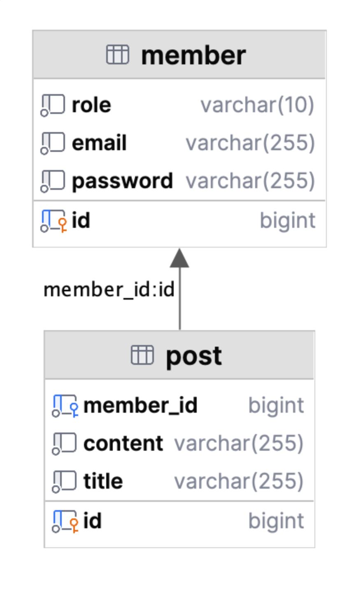
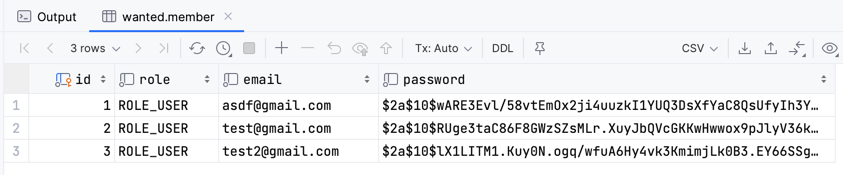
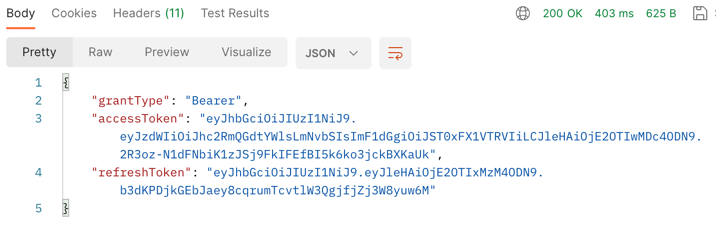

# 원티드 프리온보딩 백엔드 인턴십 - 선발 과제
<br></br>
## 지원자 정보
- 이름: 강석원
- 이메일: kangsw1988@gmail.com
- 원티드 아이디: kangsw1988@gmail.com

<br>

## 애플리케이션의 실행 방법
### 실행 조건
- docker image build & docker compose를 사용하기 때문에 docker service가 실행중이어야 한다.
### 실행 방법
1. 저장소를 로컬에 clone
```shell
git clone https://github.com/piopoi/wanted-pre-onboarding-backend.git
```
2. 프로젝트 경로로 이동
```shell
cd [프로젝트 경로]
```
3. 배포 스크립트 실행
```shell
./deploy.sh
```
- deploy.sh 요약
  - git fetch, git pull
  - gradlew clean build
  - Remove previous docker container
  - Remove previous docker image
  - docker compose up
4. [API 명세](https://htmlpreview.github.io/?https://github.com/piopoi/wanted-pre-onboarding-backend/blob/master/src/main/resources/static/docs/index.html) 확인하여 API 호출
```
(ex) 사용자 생성 URL
http://localhost:8080/member
```
<br>

## 데이터베이스 테이블 구조

[//]: # (![db_diagram]&#40;docs/db_diagram.png&#41;)

<br>

## 구현 방법 및 이유에 대한 간략한 설명
### 사용 기술: Application & DB
현재 시점의 stable 중 가장 최신 버전 사용.
- spring boot 3.1.2
- spring framework 6.0.11
- spring security 6.1.2
- spring rest docs 3.0.0
- mysql 8.0.34
### 사용 기술: Deploy
- docker
- docker compose
- shell script
### 구현 기능
사전 과제 요구사항에만 충족되도록 비즈니스 로직은 최소한으로 개발.
- 통합/단위 테스트 코드 작성.
- 사용자 생성
  - 이메일 조건: @ 포함
  - 비밀번호 조건: 8자 이상
  - 비밀번호 암호화:
  
- 로그인
  - 사용자 생성의 이메일/비밀번호 조건과 같은 유효성 검사 포함.
  - JWT 인증 적용: 
  
- 게시글: 작성 / 리스트 조회 / 단건 조회 / 수정 / 삭제
  - 리스트 조회 시 Pageable을 이용한 Pagination 처리.
  - 수정/삭제는 게시글 작성자만 가능하도록 제한.
  - 게시글 관련 모든 기능은 jwt 인증 필수.
    - Spring security 설정 위치 : src/main/java/com/wanted/wantedpreonboardingbackend/SecurityConfig.java
- 테스트
  - API 엔드포인트인 Controller layer의 테스트는 모두 RestAssured 라이브러리 사용.
    - 사전과제 어플리케이션의 크기가 작아, 성능 상 Mock과 크게 차이나지 않을 것으로 판단하여 선택함.
  - Service layer의 테스트는 Mock 사용.
### 잡담
- [Layered Architecture](https://www.google.com/search?q=Layered+Architecture)를 적용해보려고 노력함.
  - ui layer에 엔드포인트를 두고,
  - ui layer -> application layer -> domain layer 방향으로 의존성 유지.
- 테스트 주도 개발(TDD)로만 개발하려 했으나 인증 쪽은 실패함.
<br>

## API 명세(request/response 포함)
[API Documentation 바로가기](https://htmlpreview.github.io/?https://github.com/piopoi/wanted-pre-onboarding-backend/blob/master/src/main/resources/static/docs/index.html)
- 문서 위치: src/main/resources/static/docs/index.html
- build 할 때마다 새로 생성됨.
